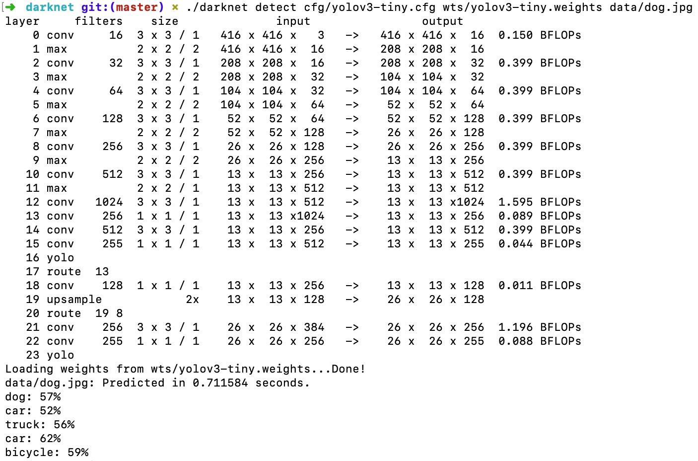
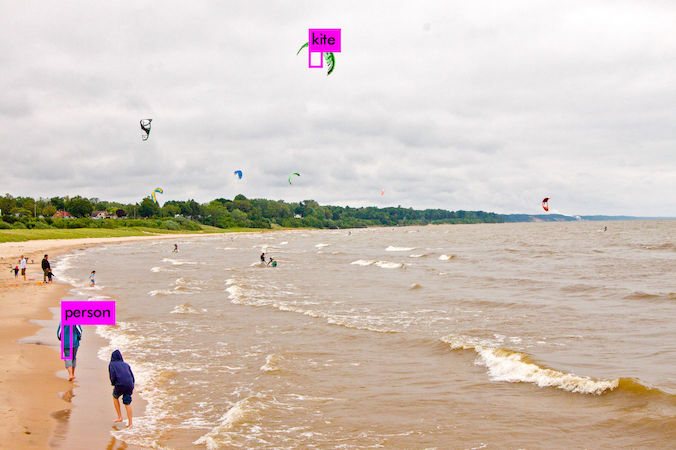

# Yolov3-Training-Dataset

[Yolov3 Homepage 主页](https://pjreddie.com/darknet/yolo/)

[Pascal VOC Dataset Mirror](https://pjreddie.com/projects/pascal-voc-dataset-mirror/)

[get_COCO_dataset](https://github.com/pjreddie/darknet/blob/master/scripts/get_coco_dataset.sh)


Yolov3 可以处理物体分类 和 物体检测 2种任务

## 0. 安装 Darknet

```
git clone https://github.com/pjreddie/darknet
cd darknet
make
```

## 1. 物体检测 Object Detection

### 1.A 推断

#### 1.A.1 使用预训练的模型进行检测 (直接做推断)

安装Darknet之后, 在克隆好的文件目录中, 存在cfg/子目录. 可以将[预训练的yolov3权重文件](https://pjreddie.com/media/files/yolov3.weights) 或者[yolov3-tiny的权重文件](https://pjreddie.com/media/files/yolov3-tiny.weights)下载到该目录。


也可以直接运行如下命令进行下载:

```
wget https://pjreddie.com/media/files/yolov3.weights

或者

wget https://pjreddie.com/media/files/yolov3-tiny.weights
```

#### 1.A.2 检测指定的图片

直接运行如下命令:

```
./darknet detect cfg/yolov3.cfg yolov3.weights data/dog.jpg

或者

./darknet detect cfg/yolov3-tiny.cfg yolov3-tiny.weights data/dog.jpg
```

运行后, 显示(Yolov3-tiny)网络结构 :



(Yolov3-tiny)推断的结果 :



Darknet 打印出了运行时间, 检测到的物体, 和概率. 

Darknet并没有和OpenCV一起编译, 所以无法直接显示图片, 而是将图片保存在磁盘.

detect 命令是简写, 完整命令如下所示 :

```
./darknet detector test cfg/coco.data cfg/yolov3.cfg yolov3.weights data/dog.jpg
```

通常Yolo 只显示物体概率值大于25%的物体, 如果需要显示更多物体, 可以将参数 -thresh <value>传给命令行：

```
./darknet detect cfg/yolov3.cfg yolov3.weights data/dog.jpg -thresh 0
```

    ```
    (detector) ➜  darknet git:(master) ✗ ./darknet detect cfg/yolov3.cfg wts/yolov3.weights data/kite.jpg
    layer     filters    size              input                output
        0 conv     32  3 x 3 / 1   608 x 608 x   3   ->   608 x 608 x  32  0.639 BFLOPs
        1 conv     64  3 x 3 / 2   608 x 608 x  32   ->   304 x 304 x  64  3.407 BFLOPs
        2 conv     32  1 x 1 / 1   304 x 304 x  64   ->   304 x 304 x  32  0.379 BFLOPs
        3 conv     64  3 x 3 / 1   304 x 304 x  32   ->   304 x 304 x  64  3.407 BFLOPs
        4 res    1                 304 x 304 x  64   ->   304 x 304 x  64
        5 conv    128  3 x 3 / 2   304 x 304 x  64   ->   152 x 152 x 128  3.407 BFLOPs
        6 conv     64  1 x 1 / 1   152 x 152 x 128   ->   152 x 152 x  64  0.379 BFLOPs
        7 conv    128  3 x 3 / 1   152 x 152 x  64   ->   152 x 152 x 128  3.407 BFLOPs
        8 res    5                 152 x 152 x 128   ->   152 x 152 x 128
        9 conv     64  1 x 1 / 1   152 x 152 x 128   ->   152 x 152 x  64  0.379 BFLOPs
      10 conv    128  3 x 3 / 1   152 x 152 x  64   ->   152 x 152 x 128  3.407 BFLOPs
      11 res    8                 152 x 152 x 128   ->   152 x 152 x 128
      12 conv    256  3 x 3 / 2   152 x 152 x 128   ->    76 x  76 x 256  3.407 BFLOPs
      13 conv    128  1 x 1 / 1    76 x  76 x 256   ->    76 x  76 x 128  0.379 BFLOPs
      14 conv    256  3 x 3 / 1    76 x  76 x 128   ->    76 x  76 x 256  3.407 BFLOPs
      15 res   12                  76 x  76 x 256   ->    76 x  76 x 256
      16 conv    128  1 x 1 / 1    76 x  76 x 256   ->    76 x  76 x 128  0.379 BFLOPs
      17 conv    256  3 x 3 / 1    76 x  76 x 128   ->    76 x  76 x 256  3.407 BFLOPs
      18 res   15                  76 x  76 x 256   ->    76 x  76 x 256
      19 conv    128  1 x 1 / 1    76 x  76 x 256   ->    76 x  76 x 128  0.379 BFLOPs
      20 conv    256  3 x 3 / 1    76 x  76 x 128   ->    76 x  76 x 256  3.407 BFLOPs
      21 res   18                  76 x  76 x 256   ->    76 x  76 x 256
      22 conv    128  1 x 1 / 1    76 x  76 x 256   ->    76 x  76 x 128  0.379 BFLOPs
      23 conv    256  3 x 3 / 1    76 x  76 x 128   ->    76 x  76 x 256  3.407 BFLOPs
      24 res   21                  76 x  76 x 256   ->    76 x  76 x 256
      25 conv    128  1 x 1 / 1    76 x  76 x 256   ->    76 x  76 x 128  0.379 BFLOPs
      26 conv    256  3 x 3 / 1    76 x  76 x 128   ->    76 x  76 x 256  3.407 BFLOPs
      27 res   24                  76 x  76 x 256   ->    76 x  76 x 256
      28 conv    128  1 x 1 / 1    76 x  76 x 256   ->    76 x  76 x 128  0.379 BFLOPs
      29 conv    256  3 x 3 / 1    76 x  76 x 128   ->    76 x  76 x 256  3.407 BFLOPs
      30 res   27                  76 x  76 x 256   ->    76 x  76 x 256
      31 conv    128  1 x 1 / 1    76 x  76 x 256   ->    76 x  76 x 128  0.379 BFLOPs
      32 conv    256  3 x 3 / 1    76 x  76 x 128   ->    76 x  76 x 256  3.407 BFLOPs
      33 res   30                  76 x  76 x 256   ->    76 x  76 x 256
      34 conv    128  1 x 1 / 1    76 x  76 x 256   ->    76 x  76 x 128  0.379 BFLOPs
      35 conv    256  3 x 3 / 1    76 x  76 x 128   ->    76 x  76 x 256  3.407 BFLOPs
      36 res   33                  76 x  76 x 256   ->    76 x  76 x 256
      37 conv    512  3 x 3 / 2    76 x  76 x 256   ->    38 x  38 x 512  3.407 BFLOPs
      38 conv    256  1 x 1 / 1    38 x  38 x 512   ->    38 x  38 x 256  0.379 BFLOPs
      39 conv    512  3 x 3 / 1    38 x  38 x 256   ->    38 x  38 x 512  3.407 BFLOPs
      40 res   37                  38 x  38 x 512   ->    38 x  38 x 512
      41 conv    256  1 x 1 / 1    38 x  38 x 512   ->    38 x  38 x 256  0.379 BFLOPs
      42 conv    512  3 x 3 / 1    38 x  38 x 256   ->    38 x  38 x 512  3.407 BFLOPs
      43 res   40                  38 x  38 x 512   ->    38 x  38 x 512
      44 conv    256  1 x 1 / 1    38 x  38 x 512   ->    38 x  38 x 256  0.379 BFLOPs
      45 conv    512  3 x 3 / 1    38 x  38 x 256   ->    38 x  38 x 512  3.407 BFLOPs
      46 res   43                  38 x  38 x 512   ->    38 x  38 x 512
      47 conv    256  1 x 1 / 1    38 x  38 x 512   ->    38 x  38 x 256  0.379 BFLOPs
      48 conv    512  3 x 3 / 1    38 x  38 x 256   ->    38 x  38 x 512  3.407 BFLOPs
      49 res   46                  38 x  38 x 512   ->    38 x  38 x 512
      50 conv    256  1 x 1 / 1    38 x  38 x 512   ->    38 x  38 x 256  0.379 BFLOPs
      51 conv    512  3 x 3 / 1    38 x  38 x 256   ->    38 x  38 x 512  3.407 BFLOPs
      52 res   49                  38 x  38 x 512   ->    38 x  38 x 512
      53 conv    256  1 x 1 / 1    38 x  38 x 512   ->    38 x  38 x 256  0.379 BFLOPs
      54 conv    512  3 x 3 / 1    38 x  38 x 256   ->    38 x  38 x 512  3.407 BFLOPs
      55 res   52                  38 x  38 x 512   ->    38 x  38 x 512
      56 conv    256  1 x 1 / 1    38 x  38 x 512   ->    38 x  38 x 256  0.379 BFLOPs
      57 conv    512  3 x 3 / 1    38 x  38 x 256   ->    38 x  38 x 512  3.407 BFLOPs
      58 res   55                  38 x  38 x 512   ->    38 x  38 x 512
      59 conv    256  1 x 1 / 1    38 x  38 x 512   ->    38 x  38 x 256  0.379 BFLOPs
      60 conv    512  3 x 3 / 1    38 x  38 x 256   ->    38 x  38 x 512  3.407 BFLOPs
      61 res   58                  38 x  38 x 512   ->    38 x  38 x 512
      62 conv   1024  3 x 3 / 2    38 x  38 x 512   ->    19 x  19 x1024  3.407 BFLOPs
      63 conv    512  1 x 1 / 1    19 x  19 x1024   ->    19 x  19 x 512  0.379 BFLOPs
      64 conv   1024  3 x 3 / 1    19 x  19 x 512   ->    19 x  19 x1024  3.407 BFLOPs
      65 res   62                  19 x  19 x1024   ->    19 x  19 x1024
      66 conv    512  1 x 1 / 1    19 x  19 x1024   ->    19 x  19 x 512  0.379 BFLOPs
      67 conv   1024  3 x 3 / 1    19 x  19 x 512   ->    19 x  19 x1024  3.407 BFLOPs
      68 res   65                  19 x  19 x1024   ->    19 x  19 x1024
      69 conv    512  1 x 1 / 1    19 x  19 x1024   ->    19 x  19 x 512  0.379 BFLOPs
      70 conv   1024  3 x 3 / 1    19 x  19 x 512   ->    19 x  19 x1024  3.407 BFLOPs
      71 res   68                  19 x  19 x1024   ->    19 x  19 x1024
      72 conv    512  1 x 1 / 1    19 x  19 x1024   ->    19 x  19 x 512  0.379 BFLOPs
      73 conv   1024  3 x 3 / 1    19 x  19 x 512   ->    19 x  19 x1024  3.407 BFLOPs
      74 res   71                  19 x  19 x1024   ->    19 x  19 x1024
      75 conv    512  1 x 1 / 1    19 x  19 x1024   ->    19 x  19 x 512  0.379 BFLOPs
      76 conv   1024  3 x 3 / 1    19 x  19 x 512   ->    19 x  19 x1024  3.407 BFLOPs
      77 conv    512  1 x 1 / 1    19 x  19 x1024   ->    19 x  19 x 512  0.379 BFLOPs
      78 conv   1024  3 x 3 / 1    19 x  19 x 512   ->    19 x  19 x1024  3.407 BFLOPs
      79 conv    512  1 x 1 / 1    19 x  19 x1024   ->    19 x  19 x 512  0.379 BFLOPs
      80 conv   1024  3 x 3 / 1    19 x  19 x 512   ->    19 x  19 x1024  3.407 BFLOPs
      81 conv    255  1 x 1 / 1    19 x  19 x1024   ->    19 x  19 x 255  0.189 BFLOPs
      82 yolo
      83 route  79
      84 conv    256  1 x 1 / 1    19 x  19 x 512   ->    19 x  19 x 256  0.095 BFLOPs
      85 upsample            2x    19 x  19 x 256   ->    38 x  38 x 256
      86 route  85 61
      87 conv    256  1 x 1 / 1    38 x  38 x 768   ->    38 x  38 x 256  0.568 BFLOPs
      88 conv    512  3 x 3 / 1    38 x  38 x 256   ->    38 x  38 x 512  3.407 BFLOPs
      89 conv    256  1 x 1 / 1    38 x  38 x 512   ->    38 x  38 x 256  0.379 BFLOPs
      90 conv    512  3 x 3 / 1    38 x  38 x 256   ->    38 x  38 x 512  3.407 BFLOPs
      91 conv    256  1 x 1 / 1    38 x  38 x 512   ->    38 x  38 x 256  0.379 BFLOPs
      92 conv    512  3 x 3 / 1    38 x  38 x 256   ->    38 x  38 x 512  3.407 BFLOPs
      93 conv    255  1 x 1 / 1    38 x  38 x 512   ->    38 x  38 x 255  0.377 BFLOPs
      94 yolo
      95 route  91
      96 conv    128  1 x 1 / 1    38 x  38 x 256   ->    38 x  38 x 128  0.095 BFLOPs
      97 upsample            2x    38 x  38 x 128   ->    76 x  76 x 128
      98 route  97 36
      99 conv    128  1 x 1 / 1    76 x  76 x 384   ->    76 x  76 x 128  0.568 BFLOPs
      100 conv    256  3 x 3 / 1    76 x  76 x 128   ->    76 x  76 x 256  3.407 BFLOPs
      101 conv    128  1 x 1 / 1    76 x  76 x 256   ->    76 x  76 x 128  0.379 BFLOPs
      102 conv    256  3 x 3 / 1    76 x  76 x 128   ->    76 x  76 x 256  3.407 BFLOPs
      103 conv    128  1 x 1 / 1    76 x  76 x 256   ->    76 x  76 x 128  0.379 BFLOPs
      104 conv    256  3 x 3 / 1    76 x  76 x 128   ->    76 x  76 x 256  3.407 BFLOPs
      105 conv    255  1 x 1 / 1    76 x  76 x 256   ->    76 x  76 x 255  0.754 BFLOPs
      106 yolo
    Loading weights from wts/yolov3.weights...Done!
    data/kite.jpg: Predicted in 17.815771 seconds.
    kite: 99%
    kite: 84%
    kite: 80%
    kite: 73%
    person: 95%
    person: 91%
    person: 88%
    person: 85%
    person: 100%
    person: 52%
    person: 100%
    person: 97%
    person: 96%
    (detector) ➜  darknet git:(master) ✗ pwd                     
    /Users/taylorguo/Documents/projects_2019/yolov3_darknet_dataset/darknet
    ```


#### 1.A.3 摄像头实时监测

检测摄像头视频, [Darknet编译时需要启用CUDA和OpenCV](https://pjreddie.com/darknet/install/#cuda).

编译后, 运行 :

```
./darknet detector demo cfg/coco.data cfg/yolov3.cfg yolov3.weights
```

### 1.B 数据集上的训练

#### 1.B.1 获取数据, 可以下载[VOC 2007-2012的所有数据](https://pjreddie.com/projects/pascal-voc-dataset-mirror/)

下载并解压数据:

```
wget https://pjreddie.com/media/files/VOCtrainval_11-May-2012.tar
wget https://pjreddie.com/media/files/VOCtrainval_06-Nov-2007.tar
wget https://pjreddie.com/media/files/VOCtest_06-Nov-2007.tar
tar xf VOCtrainval_11-May-2012.tar
tar xf VOCtrainval_06-Nov-2007.tar
tar xf VOCtest_06-Nov-2007.tar
```

#### 1.B.2 生成数据标注

Darknet读取每张图片的.txt标注文件, .txt文件中的数据格式如下:

```
<object-class> <x> <y> <width> <height>
```

x, y, width, height 是图像标注的坐标尺寸.

```
Darknet/scripts/voc_label.py   文件可以生成这样的.txt文件.
```

```
ls
2007_test.txt   VOCdevkit
2007_train.txt  voc_label.py
2007_val.txt    VOCtest_06-Nov-2007.tar
2012_train.txt  VOCtrainval_06-Nov-2007.tar
2012_val.txt    VOCtrainval_11-May-2012.tar
```

Darknet只能读取一个.txt文件, 里面包含了所有要训练的图片这样的标注信息.
```
cat 2007_train.txt 2007_val.txt 2012_*.txt > train.txt
```

以上就是准备的要训练的数据.

#### 1.B.3 修改训练配置文件

修改 Darknet/cfg/voc.data 配置文件, 匹配刚才准备好的数据:

```
  1 classes= 20
  2 train  = <path-to-voc>/train.txt
  3 valid  = <path-to-voc>2007_test.txt
  4 names = data/voc.names
  5 backup = backup
```

#### 1.B.4 下载预训练的卷积权重文件

Yolo的训练过程是要先在小图片上通过分类任务训练卷积网络的特征提取权重, 

再用大图片对分类模型进行微调,

然后使用大图片训练检测任务.

可以使用Imagenet上预训练的卷积权重.

比如, 使用 [darknet53](https://pjreddie.com/darknet/imagenet/#darknet53)模型权重.

只需要下载 [卷积层权重](https://pjreddie.com/media/files/darknet53.conv.74).

并没有找到Yolov3-tiny的卷积层权重, 需要从头训练 yolov3-tiny. 🐍🐍🐍🐍


#### 1.B.5 训练新模型

```
./darknet detector train cfg/voc.data cfg/yolov3-voc.cfg darknet53.conv.74
```


================================

## 2. 代码实现


### PyTorch 实现

  - YOLOv3-PyTorch

    [YOLOv3: Training and inference in PyTorch](https://github.com/ultralytics/yolov3)

        ```
        (yolo) ➜  yolov3 python yolov3_bridge.py

        Namespace(batch_size=1, cfg='cfg/yolov3.cfg', class_path='data/coco.names', conf_thres=0.5, image_folder='data/samples', img_size=416, nms_thres=0.45, output_folder='output', plot_flag=True, txt_out=False)

        ****** image folder :  data/samples , output folder :  output
        0 (3, 416, 416) Batch 0... (Done 1.056s)
        1 (3, 416, 416) Batch 1... (Done 1.111s)

        image 0: 'data/samples/jumpoversea.jpg'
        1 persons

        image 1: 'data/samples/manlife.jpg'
        7 persons

        Yolo-PyTorch takes 3.800 seconds

        (yolo) ➜  yolov3 pwd                    
        /Users/taylorguo/Documents/Innotech/yolo_video/v_fss/yolov3
        ```

    [Minimal PyTorch implementation of YOLOv3](https://github.com/eriklindernoren/PyTorch-YOLOv3.git) by eriklindernoren

    [YOLO_v3_tutorial_from_scratch](https://github.com/ayooshkathuria/YOLO_v3_tutorial_from_scratch), [Tutorial](https://blog.paperspace.com/how-to-implement-a-yolo-object-detector-in-pytorch/), [Code Repo](https://github.com/ayooshkathuria/pytorch-yolo-v3)


### Keras 实现

  - YOLOv2-Keras

    [YAD2K: Yet Another Darknet 2 Keras](https://github.com/allanzelener/YAD2K) - by allanzelener


  - YOLOv3-Keras

    [A Keras implementation of YOLOv3 (Tensorflow backend)](https://github.com/qqwweee/keras-yolo3) - by qqwweee

      - Convert YOLO C++ config & weights to Keras H5 file

        ```
        (keras_flask) ➜  keras-yolo3-qqwweee git:(master) ✗ python convert.py yolov3.cfg yolov3.weights model_data/yolo.h5
        Using TensorFlow backend.
        Loading weights.
        Weights Header:  0 2 0 [32013312]
        Parsing Darknet config.
        Creating Keras model.
        Parsing section net_0
        Parsing section convolutional_0
        conv2d bn leaky (3, 3, 3, 32)
        
        Instructions for updating:
        keep_dims is deprecated, use keepdims instead
        2019-03-07 16:12:02.602582: I tensorflow/core/platform/cpu_feature_guard.cc:141] Your CPU supports instructions that this TensorFlow binary was not compiled to use: AVX2 FMA
        Parsing section convolutional_1
        conv2d bn leaky (3, 3, 32, 64)
        Parsing section convolutional_2
        conv2d bn leaky (1, 1, 64, 32)
        Parsing section convolutional_3
        conv2d bn leaky (3, 3, 32, 64)
        Parsing section shortcut_0
        Parsing section convolutional_4
        conv2d bn leaky (3, 3, 64, 128)
        Parsing section convolutional_5
        conv2d bn leaky (1, 1, 128, 64)
        Parsing section convolutional_6
        conv2d bn leaky (3, 3, 64, 128)
        Parsing section shortcut_1
        Parsing section convolutional_7
        conv2d bn leaky (1, 1, 128, 64)
        Parsing section convolutional_8
        conv2d bn leaky (3, 3, 64, 128)
        Parsing section shortcut_2
        Parsing section convolutional_9
        conv2d bn leaky (3, 3, 128, 256)
        Parsing section convolutional_10
        conv2d bn leaky (1, 1, 256, 128)
        Parsing section convolutional_11
        conv2d bn leaky (3, 3, 128, 256)
        Parsing section shortcut_3
        Parsing section convolutional_12
        conv2d bn leaky (1, 1, 256, 128)
        Parsing section convolutional_13
        conv2d bn leaky (3, 3, 128, 256)
        Parsing section shortcut_4
        Parsing section convolutional_14
        conv2d bn leaky (1, 1, 256, 128)
        Parsing section convolutional_15
        conv2d bn leaky (3, 3, 128, 256)
        Parsing section shortcut_5
        Parsing section convolutional_16
        conv2d bn leaky (1, 1, 256, 128)
        Parsing section convolutional_17
        conv2d bn leaky (3, 3, 128, 256)
        Parsing section shortcut_6
        Parsing section convolutional_18
        conv2d bn leaky (1, 1, 256, 128)
        Parsing section convolutional_19
        conv2d bn leaky (3, 3, 128, 256)
        Parsing section shortcut_7
        Parsing section convolutional_20
        conv2d bn leaky (1, 1, 256, 128)
        Parsing section convolutional_21
        conv2d bn leaky (3, 3, 128, 256)
        Parsing section shortcut_8
        Parsing section convolutional_22
        conv2d bn leaky (1, 1, 256, 128)
        Parsing section convolutional_23
        conv2d bn leaky (3, 3, 128, 256)
        Parsing section shortcut_9
        Parsing section convolutional_24
        conv2d bn leaky (1, 1, 256, 128)
        Parsing section convolutional_25
        conv2d bn leaky (3, 3, 128, 256)
        Parsing section shortcut_10
        Parsing section convolutional_26
        conv2d bn leaky (3, 3, 256, 512)
        Parsing section convolutional_27
        conv2d bn leaky (1, 1, 512, 256)
        Parsing section convolutional_28
        conv2d bn leaky (3, 3, 256, 512)
        Parsing section shortcut_11
        Parsing section convolutional_29
        conv2d bn leaky (1, 1, 512, 256)
        Parsing section convolutional_30
        conv2d bn leaky (3, 3, 256, 512)
        Parsing section shortcut_12
        Parsing section convolutional_31
        conv2d bn leaky (1, 1, 512, 256)
        Parsing section convolutional_32
        conv2d bn leaky (3, 3, 256, 512)
        Parsing section shortcut_13
        Parsing section convolutional_33
        conv2d bn leaky (1, 1, 512, 256)
        Parsing section convolutional_34
        conv2d bn leaky (3, 3, 256, 512)
        Parsing section shortcut_14
        Parsing section convolutional_35
        conv2d bn leaky (1, 1, 512, 256)
        Parsing section convolutional_36
        conv2d bn leaky (3, 3, 256, 512)
        Parsing section shortcut_15
        Parsing section convolutional_37
        conv2d bn leaky (1, 1, 512, 256)
        Parsing section convolutional_38
        conv2d bn leaky (3, 3, 256, 512)
        Parsing section shortcut_16
        Parsing section convolutional_39
        conv2d bn leaky (1, 1, 512, 256)
        Parsing section convolutional_40
        conv2d bn leaky (3, 3, 256, 512)
        Parsing section shortcut_17
        Parsing section convolutional_41
        conv2d bn leaky (1, 1, 512, 256)
        Parsing section convolutional_42
        conv2d bn leaky (3, 3, 256, 512)
        Parsing section shortcut_18
        Parsing section convolutional_43
        conv2d bn leaky (3, 3, 512, 1024)
        Parsing section convolutional_44
        conv2d bn leaky (1, 1, 1024, 512)
        Parsing section convolutional_45
        conv2d bn leaky (3, 3, 512, 1024)
        Parsing section shortcut_19
        Parsing section convolutional_46
        conv2d bn leaky (1, 1, 1024, 512)
        Parsing section convolutional_47
        conv2d bn leaky (3, 3, 512, 1024)
        Parsing section shortcut_20
        Parsing section convolutional_48
        conv2d bn leaky (1, 1, 1024, 512)
        Parsing section convolutional_49
        conv2d bn leaky (3, 3, 512, 1024)
        Parsing section shortcut_21
        Parsing section convolutional_50
        conv2d bn leaky (1, 1, 1024, 512)
        Parsing section convolutional_51
        conv2d bn leaky (3, 3, 512, 1024)
        Parsing section shortcut_22
        Parsing section convolutional_52
        conv2d bn leaky (1, 1, 1024, 512)
        Parsing section convolutional_53
        conv2d bn leaky (3, 3, 512, 1024)
        Parsing section convolutional_54
        conv2d bn leaky (1, 1, 1024, 512)
        Parsing section convolutional_55
        conv2d bn leaky (3, 3, 512, 1024)
        Parsing section convolutional_56
        conv2d bn leaky (1, 1, 1024, 512)
        Parsing section convolutional_57
        conv2d bn leaky (3, 3, 512, 1024)
        Parsing section convolutional_58
        conv2d    linear (1, 1, 1024, 255)
        Parsing section yolo_0
        Parsing section route_0
        Parsing section convolutional_59
        conv2d bn leaky (1, 1, 512, 256)
        Parsing section upsample_0
        Parsing section route_1
        Concatenating route layers: [<tf.Tensor 'up_sampling2d_1/ResizeNearestNeighbor:0' shape=(?, ?, ?, 256) dtype=float32>, <tf.Tensor 'add_19/add:0' shape=(?, ?, ?, 512) dtype=float32>]
        Parsing section convolutional_60
        conv2d bn leaky (1, 1, 768, 256)
        Parsing section convolutional_61
        conv2d bn leaky (3, 3, 256, 512)
        Parsing section convolutional_62
        conv2d bn leaky (1, 1, 512, 256)
        Parsing section convolutional_63
        conv2d bn leaky (3, 3, 256, 512)
        Parsing section convolutional_64
        conv2d bn leaky (1, 1, 512, 256)
        Parsing section convolutional_65
        conv2d bn leaky (3, 3, 256, 512)
        Parsing section convolutional_66
        conv2d    linear (1, 1, 512, 255)
        Parsing section yolo_1
        Parsing section route_2
        Parsing section convolutional_67
        conv2d bn leaky (1, 1, 256, 128)
        Parsing section upsample_1
        Parsing section route_3
        Concatenating route layers: [<tf.Tensor 'up_sampling2d_2/ResizeNearestNeighbor:0' shape=(?, ?, ?, 128) dtype=float32>, <tf.Tensor 'add_11/add:0' shape=(?, ?, ?, 256) dtype=float32>]
        Parsing section convolutional_68
        conv2d bn leaky (1, 1, 384, 128)
        Parsing section convolutional_69
        conv2d bn leaky (3, 3, 128, 256)
        Parsing section convolutional_70
        conv2d bn leaky (1, 1, 256, 128)
        Parsing section convolutional_71
        conv2d bn leaky (3, 3, 128, 256)
        Parsing section convolutional_72
        conv2d bn leaky (1, 1, 256, 128)
        Parsing section convolutional_73
        conv2d bn leaky (3, 3, 128, 256)
        Parsing section convolutional_74
        conv2d    linear (1, 1, 256, 255)
        Parsing section yolo_2
        
        __________________________________________________________________________________________________
        Layer (type)                    Output Shape         Param #     Connected to                     
        ==================================================================================================
        input_1 (InputLayer)            (None, None, None, 3 0                                            
        __________________________________________________________________________________________________
        conv2d_1 (Conv2D)               (None, None, None, 3 864         input_1[0][0]                    
        __________________________________________________________________________________________________
        batch_normalization_1 (BatchNor (None, None, None, 3 128         conv2d_1[0][0]                   
        __________________________________________________________________________________________________
        leaky_re_lu_1 (LeakyReLU)       (None, None, None, 3 0           batch_normalization_1[0][0]      
        __________________________________________________________________________________________________
        zero_padding2d_1 (ZeroPadding2D (None, None, None, 3 0           leaky_re_lu_1[0][0]              
        __________________________________________________________________________________________________
        conv2d_2 (Conv2D)               (None, None, None, 6 18432       zero_padding2d_1[0][0]           
        __________________________________________________________________________________________________
        batch_normalization_2 (BatchNor (None, None, None, 6 256         conv2d_2[0][0]                   
        __________________________________________________________________________________________________
        leaky_re_lu_2 (LeakyReLU)       (None, None, None, 6 0           batch_normalization_2[0][0]      
        __________________________________________________________________________________________________
        conv2d_3 (Conv2D)               (None, None, None, 3 2048        leaky_re_lu_2[0][0]              
        __________________________________________________________________________________________________
        batch_normalization_3 (BatchNor (None, None, None, 3 128         conv2d_3[0][0]                   
        __________________________________________________________________________________________________
        leaky_re_lu_3 (LeakyReLU)       (None, None, None, 3 0           batch_normalization_3[0][0]      
        __________________________________________________________________________________________________
        conv2d_4 (Conv2D)               (None, None, None, 6 18432       leaky_re_lu_3[0][0]              
        __________________________________________________________________________________________________
        batch_normalization_4 (BatchNor (None, None, None, 6 256         conv2d_4[0][0]                   
        __________________________________________________________________________________________________
        leaky_re_lu_4 (LeakyReLU)       (None, None, None, 6 0           batch_normalization_4[0][0]      
        __________________________________________________________________________________________________
        add_1 (Add)                     (None, None, None, 6 0           leaky_re_lu_2[0][0]              
                                                                        leaky_re_lu_4[0][0]              
        __________________________________________________________________________________________________
        zero_padding2d_2 (ZeroPadding2D (None, None, None, 6 0           add_1[0][0]                      
        __________________________________________________________________________________________________
        conv2d_5 (Conv2D)               (None, None, None, 1 73728       zero_padding2d_2[0][0]           
        __________________________________________________________________________________________________
        batch_normalization_5 (BatchNor (None, None, None, 1 512         conv2d_5[0][0]                   
        __________________________________________________________________________________________________
        leaky_re_lu_5 (LeakyReLU)       (None, None, None, 1 0           batch_normalization_5[0][0]      
        __________________________________________________________________________________________________
        conv2d_6 (Conv2D)               (None, None, None, 6 8192        leaky_re_lu_5[0][0]              
        __________________________________________________________________________________________________
        batch_normalization_6 (BatchNor (None, None, None, 6 256         conv2d_6[0][0]                   
        __________________________________________________________________________________________________
        leaky_re_lu_6 (LeakyReLU)       (None, None, None, 6 0           batch_normalization_6[0][0]      
        __________________________________________________________________________________________________
        conv2d_7 (Conv2D)               (None, None, None, 1 73728       leaky_re_lu_6[0][0]              
        __________________________________________________________________________________________________
        batch_normalization_7 (BatchNor (None, None, None, 1 512         conv2d_7[0][0]                   
        __________________________________________________________________________________________________
        leaky_re_lu_7 (LeakyReLU)       (None, None, None, 1 0           batch_normalization_7[0][0]      
        __________________________________________________________________________________________________
        add_2 (Add)                     (None, None, None, 1 0           leaky_re_lu_5[0][0]              
                                                                        leaky_re_lu_7[0][0]              
        __________________________________________________________________________________________________
        conv2d_8 (Conv2D)               (None, None, None, 6 8192        add_2[0][0]                      
        __________________________________________________________________________________________________
        batch_normalization_8 (BatchNor (None, None, None, 6 256         conv2d_8[0][0]                   
        __________________________________________________________________________________________________
        leaky_re_lu_8 (LeakyReLU)       (None, None, None, 6 0           batch_normalization_8[0][0]      
        __________________________________________________________________________________________________
        conv2d_9 (Conv2D)               (None, None, None, 1 73728       leaky_re_lu_8[0][0]              
        __________________________________________________________________________________________________
        batch_normalization_9 (BatchNor (None, None, None, 1 512         conv2d_9[0][0]                   
        __________________________________________________________________________________________________
        leaky_re_lu_9 (LeakyReLU)       (None, None, None, 1 0           batch_normalization_9[0][0]      
        __________________________________________________________________________________________________
        add_3 (Add)                     (None, None, None, 1 0           add_2[0][0]                      
                                                                        leaky_re_lu_9[0][0]              
        __________________________________________________________________________________________________
        zero_padding2d_3 (ZeroPadding2D (None, None, None, 1 0           add_3[0][0]                      
        __________________________________________________________________________________________________
        conv2d_10 (Conv2D)              (None, None, None, 2 294912      zero_padding2d_3[0][0]           
        __________________________________________________________________________________________________
        batch_normalization_10 (BatchNo (None, None, None, 2 1024        conv2d_10[0][0]                  
        __________________________________________________________________________________________________
        leaky_re_lu_10 (LeakyReLU)      (None, None, None, 2 0           batch_normalization_10[0][0]     
        __________________________________________________________________________________________________
        conv2d_11 (Conv2D)              (None, None, None, 1 32768       leaky_re_lu_10[0][0]             
        __________________________________________________________________________________________________
        batch_normalization_11 (BatchNo (None, None, None, 1 512         conv2d_11[0][0]                  
        __________________________________________________________________________________________________
        leaky_re_lu_11 (LeakyReLU)      (None, None, None, 1 0           batch_normalization_11[0][0]     
        __________________________________________________________________________________________________
        conv2d_12 (Conv2D)              (None, None, None, 2 294912      leaky_re_lu_11[0][0]             
        __________________________________________________________________________________________________
        batch_normalization_12 (BatchNo (None, None, None, 2 1024        conv2d_12[0][0]                  
        __________________________________________________________________________________________________
        leaky_re_lu_12 (LeakyReLU)      (None, None, None, 2 0           batch_normalization_12[0][0]     
        __________________________________________________________________________________________________
        add_4 (Add)                     (None, None, None, 2 0           leaky_re_lu_10[0][0]             
                                                                        leaky_re_lu_12[0][0]             
        __________________________________________________________________________________________________
        conv2d_13 (Conv2D)              (None, None, None, 1 32768       add_4[0][0]                      
        __________________________________________________________________________________________________
        batch_normalization_13 (BatchNo (None, None, None, 1 512         conv2d_13[0][0]                  
        __________________________________________________________________________________________________
        leaky_re_lu_13 (LeakyReLU)      (None, None, None, 1 0           batch_normalization_13[0][0]     
        __________________________________________________________________________________________________
        conv2d_14 (Conv2D)              (None, None, None, 2 294912      leaky_re_lu_13[0][0]             
        __________________________________________________________________________________________________
        batch_normalization_14 (BatchNo (None, None, None, 2 1024        conv2d_14[0][0]                  
        __________________________________________________________________________________________________
        leaky_re_lu_14 (LeakyReLU)      (None, None, None, 2 0           batch_normalization_14[0][0]     
        __________________________________________________________________________________________________
        add_5 (Add)                     (None, None, None, 2 0           add_4[0][0]                      
                                                                        leaky_re_lu_14[0][0]             
        __________________________________________________________________________________________________
        conv2d_15 (Conv2D)              (None, None, None, 1 32768       add_5[0][0]                      
        __________________________________________________________________________________________________
        batch_normalization_15 (BatchNo (None, None, None, 1 512         conv2d_15[0][0]                  
        __________________________________________________________________________________________________
        leaky_re_lu_15 (LeakyReLU)      (None, None, None, 1 0           batch_normalization_15[0][0]     
        __________________________________________________________________________________________________
        conv2d_16 (Conv2D)              (None, None, None, 2 294912      leaky_re_lu_15[0][0]             
        __________________________________________________________________________________________________
        batch_normalization_16 (BatchNo (None, None, None, 2 1024        conv2d_16[0][0]                  
        __________________________________________________________________________________________________
        leaky_re_lu_16 (LeakyReLU)      (None, None, None, 2 0           batch_normalization_16[0][0]     
        __________________________________________________________________________________________________
        add_6 (Add)                     (None, None, None, 2 0           add_5[0][0]                      
                                                                        leaky_re_lu_16[0][0]             
        __________________________________________________________________________________________________
        conv2d_17 (Conv2D)              (None, None, None, 1 32768       add_6[0][0]                      
        __________________________________________________________________________________________________
        batch_normalization_17 (BatchNo (None, None, None, 1 512         conv2d_17[0][0]                  
        __________________________________________________________________________________________________
        leaky_re_lu_17 (LeakyReLU)      (None, None, None, 1 0           batch_normalization_17[0][0]     
        __________________________________________________________________________________________________
        conv2d_18 (Conv2D)              (None, None, None, 2 294912      leaky_re_lu_17[0][0]             
        __________________________________________________________________________________________________
        batch_normalization_18 (BatchNo (None, None, None, 2 1024        conv2d_18[0][0]                  
        __________________________________________________________________________________________________
        leaky_re_lu_18 (LeakyReLU)      (None, None, None, 2 0           batch_normalization_18[0][0]     
        __________________________________________________________________________________________________
        add_7 (Add)                     (None, None, None, 2 0           add_6[0][0]                      
                                                                        leaky_re_lu_18[0][0]             
        __________________________________________________________________________________________________
        conv2d_19 (Conv2D)              (None, None, None, 1 32768       add_7[0][0]                      
        __________________________________________________________________________________________________
        batch_normalization_19 (BatchNo (None, None, None, 1 512         conv2d_19[0][0]                  
        __________________________________________________________________________________________________
        leaky_re_lu_19 (LeakyReLU)      (None, None, None, 1 0           batch_normalization_19[0][0]     
        __________________________________________________________________________________________________
        conv2d_20 (Conv2D)              (None, None, None, 2 294912      leaky_re_lu_19[0][0]             
        __________________________________________________________________________________________________
        batch_normalization_20 (BatchNo (None, None, None, 2 1024        conv2d_20[0][0]                  
        __________________________________________________________________________________________________
        leaky_re_lu_20 (LeakyReLU)      (None, None, None, 2 0           batch_normalization_20[0][0]     
        __________________________________________________________________________________________________
        add_8 (Add)                     (None, None, None, 2 0           add_7[0][0]                      
                                                                        leaky_re_lu_20[0][0]             
        __________________________________________________________________________________________________
        conv2d_21 (Conv2D)              (None, None, None, 1 32768       add_8[0][0]                      
        __________________________________________________________________________________________________
        batch_normalization_21 (BatchNo (None, None, None, 1 512         conv2d_21[0][0]                  
        __________________________________________________________________________________________________
        leaky_re_lu_21 (LeakyReLU)      (None, None, None, 1 0           batch_normalization_21[0][0]     
        __________________________________________________________________________________________________
        conv2d_22 (Conv2D)              (None, None, None, 2 294912      leaky_re_lu_21[0][0]             
        __________________________________________________________________________________________________
        batch_normalization_22 (BatchNo (None, None, None, 2 1024        conv2d_22[0][0]                  
        __________________________________________________________________________________________________
        leaky_re_lu_22 (LeakyReLU)      (None, None, None, 2 0           batch_normalization_22[0][0]     
        __________________________________________________________________________________________________
        add_9 (Add)                     (None, None, None, 2 0           add_8[0][0]                      
                                                                        leaky_re_lu_22[0][0]             
        __________________________________________________________________________________________________
        conv2d_23 (Conv2D)              (None, None, None, 1 32768       add_9[0][0]                      
        __________________________________________________________________________________________________
        batch_normalization_23 (BatchNo (None, None, None, 1 512         conv2d_23[0][0]                  
        __________________________________________________________________________________________________
        leaky_re_lu_23 (LeakyReLU)      (None, None, None, 1 0           batch_normalization_23[0][0]     
        __________________________________________________________________________________________________
        conv2d_24 (Conv2D)              (None, None, None, 2 294912      leaky_re_lu_23[0][0]             
        __________________________________________________________________________________________________
        batch_normalization_24 (BatchNo (None, None, None, 2 1024        conv2d_24[0][0]                  
        __________________________________________________________________________________________________
        leaky_re_lu_24 (LeakyReLU)      (None, None, None, 2 0           batch_normalization_24[0][0]     
        __________________________________________________________________________________________________
        add_10 (Add)                    (None, None, None, 2 0           add_9[0][0]                      
                                                                        leaky_re_lu_24[0][0]             
        __________________________________________________________________________________________________
        conv2d_25 (Conv2D)              (None, None, None, 1 32768       add_10[0][0]                     
        __________________________________________________________________________________________________
        batch_normalization_25 (BatchNo (None, None, None, 1 512         conv2d_25[0][0]                  
        __________________________________________________________________________________________________
        leaky_re_lu_25 (LeakyReLU)      (None, None, None, 1 0           batch_normalization_25[0][0]     
        __________________________________________________________________________________________________
        conv2d_26 (Conv2D)              (None, None, None, 2 294912      leaky_re_lu_25[0][0]             
        __________________________________________________________________________________________________
        batch_normalization_26 (BatchNo (None, None, None, 2 1024        conv2d_26[0][0]                  
        __________________________________________________________________________________________________
        leaky_re_lu_26 (LeakyReLU)      (None, None, None, 2 0           batch_normalization_26[0][0]     
        __________________________________________________________________________________________________
        add_11 (Add)                    (None, None, None, 2 0           add_10[0][0]                     
                                                                        leaky_re_lu_26[0][0]             
        __________________________________________________________________________________________________
        zero_padding2d_4 (ZeroPadding2D (None, None, None, 2 0           add_11[0][0]                     
        __________________________________________________________________________________________________
        conv2d_27 (Conv2D)              (None, None, None, 5 1179648     zero_padding2d_4[0][0]           
        __________________________________________________________________________________________________
        batch_normalization_27 (BatchNo (None, None, None, 5 2048        conv2d_27[0][0]                  
        __________________________________________________________________________________________________
        leaky_re_lu_27 (LeakyReLU)      (None, None, None, 5 0           batch_normalization_27[0][0]     
        __________________________________________________________________________________________________
        conv2d_28 (Conv2D)              (None, None, None, 2 131072      leaky_re_lu_27[0][0]             
        __________________________________________________________________________________________________
        batch_normalization_28 (BatchNo (None, None, None, 2 1024        conv2d_28[0][0]                  
        __________________________________________________________________________________________________
        leaky_re_lu_28 (LeakyReLU)      (None, None, None, 2 0           batch_normalization_28[0][0]     
        __________________________________________________________________________________________________
        conv2d_29 (Conv2D)              (None, None, None, 5 1179648     leaky_re_lu_28[0][0]             
        __________________________________________________________________________________________________
        batch_normalization_29 (BatchNo (None, None, None, 5 2048        conv2d_29[0][0]                  
        __________________________________________________________________________________________________
        leaky_re_lu_29 (LeakyReLU)      (None, None, None, 5 0           batch_normalization_29[0][0]     
        __________________________________________________________________________________________________
        add_12 (Add)                    (None, None, None, 5 0           leaky_re_lu_27[0][0]             
                                                                        leaky_re_lu_29[0][0]             
        __________________________________________________________________________________________________
        conv2d_30 (Conv2D)              (None, None, None, 2 131072      add_12[0][0]                     
        __________________________________________________________________________________________________
        batch_normalization_30 (BatchNo (None, None, None, 2 1024        conv2d_30[0][0]                  
        __________________________________________________________________________________________________
        leaky_re_lu_30 (LeakyReLU)      (None, None, None, 2 0           batch_normalization_30[0][0]     
        __________________________________________________________________________________________________
        conv2d_31 (Conv2D)              (None, None, None, 5 1179648     leaky_re_lu_30[0][0]             
        __________________________________________________________________________________________________
        batch_normalization_31 (BatchNo (None, None, None, 5 2048        conv2d_31[0][0]                  
        __________________________________________________________________________________________________
        leaky_re_lu_31 (LeakyReLU)      (None, None, None, 5 0           batch_normalization_31[0][0]     
        __________________________________________________________________________________________________
        add_13 (Add)                    (None, None, None, 5 0           add_12[0][0]                     
                                                                        leaky_re_lu_31[0][0]             
        __________________________________________________________________________________________________
        conv2d_32 (Conv2D)              (None, None, None, 2 131072      add_13[0][0]                     
        __________________________________________________________________________________________________
        batch_normalization_32 (BatchNo (None, None, None, 2 1024        conv2d_32[0][0]                  
        __________________________________________________________________________________________________
        leaky_re_lu_32 (LeakyReLU)      (None, None, None, 2 0           batch_normalization_32[0][0]     
        __________________________________________________________________________________________________
        conv2d_33 (Conv2D)              (None, None, None, 5 1179648     leaky_re_lu_32[0][0]             
        __________________________________________________________________________________________________
        batch_normalization_33 (BatchNo (None, None, None, 5 2048        conv2d_33[0][0]                  
        __________________________________________________________________________________________________
        leaky_re_lu_33 (LeakyReLU)      (None, None, None, 5 0           batch_normalization_33[0][0]     
        __________________________________________________________________________________________________
        add_14 (Add)                    (None, None, None, 5 0           add_13[0][0]                     
                                                                        leaky_re_lu_33[0][0]             
        __________________________________________________________________________________________________
        conv2d_34 (Conv2D)              (None, None, None, 2 131072      add_14[0][0]                     
        __________________________________________________________________________________________________
        batch_normalization_34 (BatchNo (None, None, None, 2 1024        conv2d_34[0][0]                  
        __________________________________________________________________________________________________
        leaky_re_lu_34 (LeakyReLU)      (None, None, None, 2 0           batch_normalization_34[0][0]     
        __________________________________________________________________________________________________
        conv2d_35 (Conv2D)              (None, None, None, 5 1179648     leaky_re_lu_34[0][0]             
        __________________________________________________________________________________________________
        batch_normalization_35 (BatchNo (None, None, None, 5 2048        conv2d_35[0][0]                  
        __________________________________________________________________________________________________
        leaky_re_lu_35 (LeakyReLU)      (None, None, None, 5 0           batch_normalization_35[0][0]     
        __________________________________________________________________________________________________
        add_15 (Add)                    (None, None, None, 5 0           add_14[0][0]                     
                                                                        leaky_re_lu_35[0][0]             
        __________________________________________________________________________________________________
        conv2d_36 (Conv2D)              (None, None, None, 2 131072      add_15[0][0]                     
        __________________________________________________________________________________________________
        batch_normalization_36 (BatchNo (None, None, None, 2 1024        conv2d_36[0][0]                  
        __________________________________________________________________________________________________
        leaky_re_lu_36 (LeakyReLU)      (None, None, None, 2 0           batch_normalization_36[0][0]     
        __________________________________________________________________________________________________
        conv2d_37 (Conv2D)              (None, None, None, 5 1179648     leaky_re_lu_36[0][0]             
        __________________________________________________________________________________________________
        batch_normalization_37 (BatchNo (None, None, None, 5 2048        conv2d_37[0][0]                  
        __________________________________________________________________________________________________
        leaky_re_lu_37 (LeakyReLU)      (None, None, None, 5 0           batch_normalization_37[0][0]     
        __________________________________________________________________________________________________
        add_16 (Add)                    (None, None, None, 5 0           add_15[0][0]                     
                                                                        leaky_re_lu_37[0][0]             
        __________________________________________________________________________________________________
        conv2d_38 (Conv2D)              (None, None, None, 2 131072      add_16[0][0]                     
        __________________________________________________________________________________________________
        batch_normalization_38 (BatchNo (None, None, None, 2 1024        conv2d_38[0][0]                  
        __________________________________________________________________________________________________
        leaky_re_lu_38 (LeakyReLU)      (None, None, None, 2 0           batch_normalization_38[0][0]     
        __________________________________________________________________________________________________
        conv2d_39 (Conv2D)              (None, None, None, 5 1179648     leaky_re_lu_38[0][0]             
        __________________________________________________________________________________________________
        batch_normalization_39 (BatchNo (None, None, None, 5 2048        conv2d_39[0][0]                  
        __________________________________________________________________________________________________
        leaky_re_lu_39 (LeakyReLU)      (None, None, None, 5 0           batch_normalization_39[0][0]     
        __________________________________________________________________________________________________
        add_17 (Add)                    (None, None, None, 5 0           add_16[0][0]                     
                                                                        leaky_re_lu_39[0][0]             
        __________________________________________________________________________________________________
        conv2d_40 (Conv2D)              (None, None, None, 2 131072      add_17[0][0]                     
        __________________________________________________________________________________________________
        batch_normalization_40 (BatchNo (None, None, None, 2 1024        conv2d_40[0][0]                  
        __________________________________________________________________________________________________
        leaky_re_lu_40 (LeakyReLU)      (None, None, None, 2 0           batch_normalization_40[0][0]     
        __________________________________________________________________________________________________
        conv2d_41 (Conv2D)              (None, None, None, 5 1179648     leaky_re_lu_40[0][0]             
        __________________________________________________________________________________________________
        batch_normalization_41 (BatchNo (None, None, None, 5 2048        conv2d_41[0][0]                  
        __________________________________________________________________________________________________
        leaky_re_lu_41 (LeakyReLU)      (None, None, None, 5 0           batch_normalization_41[0][0]     
        __________________________________________________________________________________________________
        add_18 (Add)                    (None, None, None, 5 0           add_17[0][0]                     
                                                                        leaky_re_lu_41[0][0]             
        __________________________________________________________________________________________________
        conv2d_42 (Conv2D)              (None, None, None, 2 131072      add_18[0][0]                     
        __________________________________________________________________________________________________
        batch_normalization_42 (BatchNo (None, None, None, 2 1024        conv2d_42[0][0]                  
        __________________________________________________________________________________________________
        leaky_re_lu_42 (LeakyReLU)      (None, None, None, 2 0           batch_normalization_42[0][0]     
        __________________________________________________________________________________________________
        conv2d_43 (Conv2D)              (None, None, None, 5 1179648     leaky_re_lu_42[0][0]             
        __________________________________________________________________________________________________
        batch_normalization_43 (BatchNo (None, None, None, 5 2048        conv2d_43[0][0]                  
        __________________________________________________________________________________________________
        leaky_re_lu_43 (LeakyReLU)      (None, None, None, 5 0           batch_normalization_43[0][0]     
        __________________________________________________________________________________________________
        add_19 (Add)                    (None, None, None, 5 0           add_18[0][0]                     
                                                                        leaky_re_lu_43[0][0]             
        __________________________________________________________________________________________________
        zero_padding2d_5 (ZeroPadding2D (None, None, None, 5 0           add_19[0][0]                     
        __________________________________________________________________________________________________
        conv2d_44 (Conv2D)              (None, None, None, 1 4718592     zero_padding2d_5[0][0]           
        __________________________________________________________________________________________________
        batch_normalization_44 (BatchNo (None, None, None, 1 4096        conv2d_44[0][0]                  
        __________________________________________________________________________________________________
        leaky_re_lu_44 (LeakyReLU)      (None, None, None, 1 0           batch_normalization_44[0][0]     
        __________________________________________________________________________________________________
        conv2d_45 (Conv2D)              (None, None, None, 5 524288      leaky_re_lu_44[0][0]             
        __________________________________________________________________________________________________
        batch_normalization_45 (BatchNo (None, None, None, 5 2048        conv2d_45[0][0]                  
        __________________________________________________________________________________________________
        leaky_re_lu_45 (LeakyReLU)      (None, None, None, 5 0           batch_normalization_45[0][0]     
        __________________________________________________________________________________________________
        conv2d_46 (Conv2D)              (None, None, None, 1 4718592     leaky_re_lu_45[0][0]             
        __________________________________________________________________________________________________
        batch_normalization_46 (BatchNo (None, None, None, 1 4096        conv2d_46[0][0]                  
        __________________________________________________________________________________________________
        leaky_re_lu_46 (LeakyReLU)      (None, None, None, 1 0           batch_normalization_46[0][0]     
        __________________________________________________________________________________________________
        add_20 (Add)                    (None, None, None, 1 0           leaky_re_lu_44[0][0]             
                                                                        leaky_re_lu_46[0][0]             
        __________________________________________________________________________________________________
        conv2d_47 (Conv2D)              (None, None, None, 5 524288      add_20[0][0]                     
        __________________________________________________________________________________________________
        batch_normalization_47 (BatchNo (None, None, None, 5 2048        conv2d_47[0][0]                  
        __________________________________________________________________________________________________
        leaky_re_lu_47 (LeakyReLU)      (None, None, None, 5 0           batch_normalization_47[0][0]     
        __________________________________________________________________________________________________
        conv2d_48 (Conv2D)              (None, None, None, 1 4718592     leaky_re_lu_47[0][0]             
        __________________________________________________________________________________________________
        batch_normalization_48 (BatchNo (None, None, None, 1 4096        conv2d_48[0][0]                  
        __________________________________________________________________________________________________
        leaky_re_lu_48 (LeakyReLU)      (None, None, None, 1 0           batch_normalization_48[0][0]     
        __________________________________________________________________________________________________
        add_21 (Add)                    (None, None, None, 1 0           add_20[0][0]                     
                                                                        leaky_re_lu_48[0][0]             
        __________________________________________________________________________________________________
        conv2d_49 (Conv2D)              (None, None, None, 5 524288      add_21[0][0]                     
        __________________________________________________________________________________________________
        batch_normalization_49 (BatchNo (None, None, None, 5 2048        conv2d_49[0][0]                  
        __________________________________________________________________________________________________
        leaky_re_lu_49 (LeakyReLU)      (None, None, None, 5 0           batch_normalization_49[0][0]     
        __________________________________________________________________________________________________
        conv2d_50 (Conv2D)              (None, None, None, 1 4718592     leaky_re_lu_49[0][0]             
        __________________________________________________________________________________________________
        batch_normalization_50 (BatchNo (None, None, None, 1 4096        conv2d_50[0][0]                  
        __________________________________________________________________________________________________
        leaky_re_lu_50 (LeakyReLU)      (None, None, None, 1 0           batch_normalization_50[0][0]     
        __________________________________________________________________________________________________
        add_22 (Add)                    (None, None, None, 1 0           add_21[0][0]                     
                                                                        leaky_re_lu_50[0][0]             
        __________________________________________________________________________________________________
        conv2d_51 (Conv2D)              (None, None, None, 5 524288      add_22[0][0]                     
        __________________________________________________________________________________________________
        batch_normalization_51 (BatchNo (None, None, None, 5 2048        conv2d_51[0][0]                  
        __________________________________________________________________________________________________
        leaky_re_lu_51 (LeakyReLU)      (None, None, None, 5 0           batch_normalization_51[0][0]     
        __________________________________________________________________________________________________
        conv2d_52 (Conv2D)              (None, None, None, 1 4718592     leaky_re_lu_51[0][0]             
        __________________________________________________________________________________________________
        batch_normalization_52 (BatchNo (None, None, None, 1 4096        conv2d_52[0][0]                  
        __________________________________________________________________________________________________
        leaky_re_lu_52 (LeakyReLU)      (None, None, None, 1 0           batch_normalization_52[0][0]     
        __________________________________________________________________________________________________
        add_23 (Add)                    (None, None, None, 1 0           add_22[0][0]                     
                                                                        leaky_re_lu_52[0][0]             
        __________________________________________________________________________________________________
        conv2d_53 (Conv2D)              (None, None, None, 5 524288      add_23[0][0]                     
        __________________________________________________________________________________________________
        batch_normalization_53 (BatchNo (None, None, None, 5 2048        conv2d_53[0][0]                  
        __________________________________________________________________________________________________
        leaky_re_lu_53 (LeakyReLU)      (None, None, None, 5 0           batch_normalization_53[0][0]     
        __________________________________________________________________________________________________
        conv2d_54 (Conv2D)              (None, None, None, 1 4718592     leaky_re_lu_53[0][0]             
        __________________________________________________________________________________________________
        batch_normalization_54 (BatchNo (None, None, None, 1 4096        conv2d_54[0][0]                  
        __________________________________________________________________________________________________
        leaky_re_lu_54 (LeakyReLU)      (None, None, None, 1 0           batch_normalization_54[0][0]     
        __________________________________________________________________________________________________
        conv2d_55 (Conv2D)              (None, None, None, 5 524288      leaky_re_lu_54[0][0]             
        __________________________________________________________________________________________________
        batch_normalization_55 (BatchNo (None, None, None, 5 2048        conv2d_55[0][0]                  
        __________________________________________________________________________________________________
        leaky_re_lu_55 (LeakyReLU)      (None, None, None, 5 0           batch_normalization_55[0][0]     
        __________________________________________________________________________________________________
        conv2d_56 (Conv2D)              (None, None, None, 1 4718592     leaky_re_lu_55[0][0]             
        __________________________________________________________________________________________________
        batch_normalization_56 (BatchNo (None, None, None, 1 4096        conv2d_56[0][0]                  
        __________________________________________________________________________________________________
        leaky_re_lu_56 (LeakyReLU)      (None, None, None, 1 0           batch_normalization_56[0][0]     
        __________________________________________________________________________________________________
        conv2d_57 (Conv2D)              (None, None, None, 5 524288      leaky_re_lu_56[0][0]             
        __________________________________________________________________________________________________
        batch_normalization_57 (BatchNo (None, None, None, 5 2048        conv2d_57[0][0]                  
        __________________________________________________________________________________________________
        leaky_re_lu_57 (LeakyReLU)      (None, None, None, 5 0           batch_normalization_57[0][0]     
        __________________________________________________________________________________________________
        conv2d_60 (Conv2D)              (None, None, None, 2 131072      leaky_re_lu_57[0][0]             
        __________________________________________________________________________________________________
        batch_normalization_59 (BatchNo (None, None, None, 2 1024        conv2d_60[0][0]                  
        __________________________________________________________________________________________________
        leaky_re_lu_59 (LeakyReLU)      (None, None, None, 2 0           batch_normalization_59[0][0]     
        __________________________________________________________________________________________________
        up_sampling2d_1 (UpSampling2D)  (None, None, None, 2 0           leaky_re_lu_59[0][0]             
        __________________________________________________________________________________________________
        concatenate_1 (Concatenate)     (None, None, None, 7 0           up_sampling2d_1[0][0]            
                                                                        add_19[0][0]                     
        __________________________________________________________________________________________________
        conv2d_61 (Conv2D)              (None, None, None, 2 196608      concatenate_1[0][0]              
        __________________________________________________________________________________________________
        batch_normalization_60 (BatchNo (None, None, None, 2 1024        conv2d_61[0][0]                  
        __________________________________________________________________________________________________
        leaky_re_lu_60 (LeakyReLU)      (None, None, None, 2 0           batch_normalization_60[0][0]     
        __________________________________________________________________________________________________
        conv2d_62 (Conv2D)              (None, None, None, 5 1179648     leaky_re_lu_60[0][0]             
        __________________________________________________________________________________________________
        batch_normalization_61 (BatchNo (None, None, None, 5 2048        conv2d_62[0][0]                  
        __________________________________________________________________________________________________
        leaky_re_lu_61 (LeakyReLU)      (None, None, None, 5 0           batch_normalization_61[0][0]     
        __________________________________________________________________________________________________
        conv2d_63 (Conv2D)              (None, None, None, 2 131072      leaky_re_lu_61[0][0]             
        __________________________________________________________________________________________________
        batch_normalization_62 (BatchNo (None, None, None, 2 1024        conv2d_63[0][0]                  
        __________________________________________________________________________________________________
        leaky_re_lu_62 (LeakyReLU)      (None, None, None, 2 0           batch_normalization_62[0][0]     
        __________________________________________________________________________________________________
        conv2d_64 (Conv2D)              (None, None, None, 5 1179648     leaky_re_lu_62[0][0]             
        __________________________________________________________________________________________________
        batch_normalization_63 (BatchNo (None, None, None, 5 2048        conv2d_64[0][0]                  
        __________________________________________________________________________________________________
        leaky_re_lu_63 (LeakyReLU)      (None, None, None, 5 0           batch_normalization_63[0][0]     
        __________________________________________________________________________________________________
        conv2d_65 (Conv2D)              (None, None, None, 2 131072      leaky_re_lu_63[0][0]             
        __________________________________________________________________________________________________
        batch_normalization_64 (BatchNo (None, None, None, 2 1024        conv2d_65[0][0]                  
        __________________________________________________________________________________________________
        leaky_re_lu_64 (LeakyReLU)      (None, None, None, 2 0           batch_normalization_64[0][0]     
        __________________________________________________________________________________________________
        conv2d_68 (Conv2D)              (None, None, None, 1 32768       leaky_re_lu_64[0][0]             
        __________________________________________________________________________________________________
        batch_normalization_66 (BatchNo (None, None, None, 1 512         conv2d_68[0][0]                  
        __________________________________________________________________________________________________
        leaky_re_lu_66 (LeakyReLU)      (None, None, None, 1 0           batch_normalization_66[0][0]     
        __________________________________________________________________________________________________
        up_sampling2d_2 (UpSampling2D)  (None, None, None, 1 0           leaky_re_lu_66[0][0]             
        __________________________________________________________________________________________________
        concatenate_2 (Concatenate)     (None, None, None, 3 0           up_sampling2d_2[0][0]            
                                                                        add_11[0][0]                     
        __________________________________________________________________________________________________
        conv2d_69 (Conv2D)              (None, None, None, 1 49152       concatenate_2[0][0]              
        __________________________________________________________________________________________________
        batch_normalization_67 (BatchNo (None, None, None, 1 512         conv2d_69[0][0]                  
        __________________________________________________________________________________________________
        leaky_re_lu_67 (LeakyReLU)      (None, None, None, 1 0           batch_normalization_67[0][0]     
        __________________________________________________________________________________________________
        conv2d_70 (Conv2D)              (None, None, None, 2 294912      leaky_re_lu_67[0][0]             
        __________________________________________________________________________________________________
        batch_normalization_68 (BatchNo (None, None, None, 2 1024        conv2d_70[0][0]                  
        __________________________________________________________________________________________________
        leaky_re_lu_68 (LeakyReLU)      (None, None, None, 2 0           batch_normalization_68[0][0]     
        __________________________________________________________________________________________________
        conv2d_71 (Conv2D)              (None, None, None, 1 32768       leaky_re_lu_68[0][0]             
        __________________________________________________________________________________________________
        batch_normalization_69 (BatchNo (None, None, None, 1 512         conv2d_71[0][0]                  
        __________________________________________________________________________________________________
        leaky_re_lu_69 (LeakyReLU)      (None, None, None, 1 0           batch_normalization_69[0][0]     
        __________________________________________________________________________________________________
        conv2d_72 (Conv2D)              (None, None, None, 2 294912      leaky_re_lu_69[0][0]             
        __________________________________________________________________________________________________
        batch_normalization_70 (BatchNo (None, None, None, 2 1024        conv2d_72[0][0]                  
        __________________________________________________________________________________________________
        leaky_re_lu_70 (LeakyReLU)      (None, None, None, 2 0           batch_normalization_70[0][0]     
        __________________________________________________________________________________________________
        conv2d_73 (Conv2D)              (None, None, None, 1 32768       leaky_re_lu_70[0][0]             
        __________________________________________________________________________________________________
        batch_normalization_71 (BatchNo (None, None, None, 1 512         conv2d_73[0][0]                  
        __________________________________________________________________________________________________
        leaky_re_lu_71 (LeakyReLU)      (None, None, None, 1 0           batch_normalization_71[0][0]     
        __________________________________________________________________________________________________
        conv2d_58 (Conv2D)              (None, None, None, 1 4718592     leaky_re_lu_57[0][0]             
        __________________________________________________________________________________________________
        conv2d_66 (Conv2D)              (None, None, None, 5 1179648     leaky_re_lu_64[0][0]             
        __________________________________________________________________________________________________
        conv2d_74 (Conv2D)              (None, None, None, 2 294912      leaky_re_lu_71[0][0]             
        __________________________________________________________________________________________________
        batch_normalization_58 (BatchNo (None, None, None, 1 4096        conv2d_58[0][0]                  
        __________________________________________________________________________________________________
        batch_normalization_65 (BatchNo (None, None, None, 5 2048        conv2d_66[0][0]                  
        __________________________________________________________________________________________________
        batch_normalization_72 (BatchNo (None, None, None, 2 1024        conv2d_74[0][0]                  
        __________________________________________________________________________________________________
        leaky_re_lu_58 (LeakyReLU)      (None, None, None, 1 0           batch_normalization_58[0][0]     
        __________________________________________________________________________________________________
        leaky_re_lu_65 (LeakyReLU)      (None, None, None, 5 0           batch_normalization_65[0][0]     
        __________________________________________________________________________________________________
        leaky_re_lu_72 (LeakyReLU)      (None, None, None, 2 0           batch_normalization_72[0][0]     
        __________________________________________________________________________________________________
        conv2d_59 (Conv2D)              (None, None, None, 2 261375      leaky_re_lu_58[0][0]             
        __________________________________________________________________________________________________
        conv2d_67 (Conv2D)              (None, None, None, 2 130815      leaky_re_lu_65[0][0]             
        __________________________________________________________________________________________________
        conv2d_75 (Conv2D)              (None, None, None, 2 65535       leaky_re_lu_72[0][0]             
        ==================================================================================================
        Total params: 62,001,757
        Trainable params: 61,949,149
        Non-trainable params: 52,608
        __________________________________________________________________________________________________
        None
        Saved Keras model to model_data/yolo.h5
        Read 62001757 of 62001757.0 from Darknet weights.
        
        
        (keras_flask) ➜  keras-yolo3-qqwweee git:(master) ✗ python yolo_video.py --image --input /Users/taylorguo/Documents/Innotech/yolo_video/video_fss/yolov3/data/samples
        Using TensorFlow backend.
        Image detection mode
        
        Input image filename:/Users/taylorguo/Documents/Innotech/yolo_video/video_fss/yolov3/data/samples/manlife.jpg
        (416, 416, 3)
        Found 7 boxes for img
        person 0.96 (78, 394) (235, 485)
        person 0.99 (828, 150) (1006, 491)
        person 0.99 (1001, 184) (1186, 507)
        person 1.00 (377, 168) (477, 493)
        person 1.00 (669, 132) (831, 494)
        person 1.00 (260, 217) (342, 498)
        person 1.00 (510, 134) (644, 490)
        3.515515408013016

        Input image filename:/Users/taylorguo/Documents/Innotech/yolo_video/video_fss/yolov3/data/samples/jumpoversea.jpg    
        (416, 416, 3)
        Found 1 boxes for img
        person 0.99 (294, 186) (598, 426)
        1.3040821250178851
        
        (keras_flask) ➜  keras-yolo3-qqwweee git:(master) ✗ pwd
        /Users/taylorguo/Documents/project2019_mar/yolov3/keras-yolo3-qqwweee

        ```

  - YOLOv3-Keras

    [Training and Detecting Objects with YOLO3](https://github.com/experiencor/keras-yolo3) - by experiencor